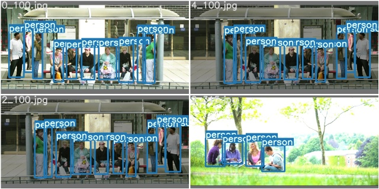

People Tracking 
============

Object tracking is a field within computer vision that involves tracking and detecting objects as they move across several video frames. Both detection and tracking people are challenging problems. Especially in complex real world scenes that commonly involve multiple people, complicated occlusions and cluttered or even moving backgrounds. 

<table border="0">
   <tr>
      <td>
      
      </td>
     </tr>
   </table>

In this project, I tried to use `YOLO-V5 PyTorch` framework to track pedestrains. 

Table of contents
==================

<!--ts-->
* [Framework](#Framework)
* [Training](#Traing)
* [Result](#Result)
      
<!--te-->

Framework
===========

Training
=============

<table border="0">
   <tr>
      <td>
      
      </td>
   </tr>
</table>

<table border="0">
   <tr>
      <td>
      
      </td>
      <td>
      
      </td>
   </tr>
   </table>

<table border="0">
   <tr>
      <td>
      
      </td>
      <td>
      
      </td>
   </tr>
   </table>

Result
=======
<table border="0">
   <tr>
      <td>
      
      </td>
      <td>
      
      </td>
   </tr>
</table>

<table border="0">
   <tr>
      <td>
      
      </td>
      <td>
      
      </td>
      <td>
      
      </td>
      <td>
      
      </td>
   </tr>
   </table>

Test
=====

<table border="0">
   <tr>
      <td>
      
      </td>
      <td>
      
      </td>
     </tr>
   </table>

[![Demo video]](https://www.youtube.com/watch?v=a7xQ0Zo8IEA)

**Images**

 
 
 
