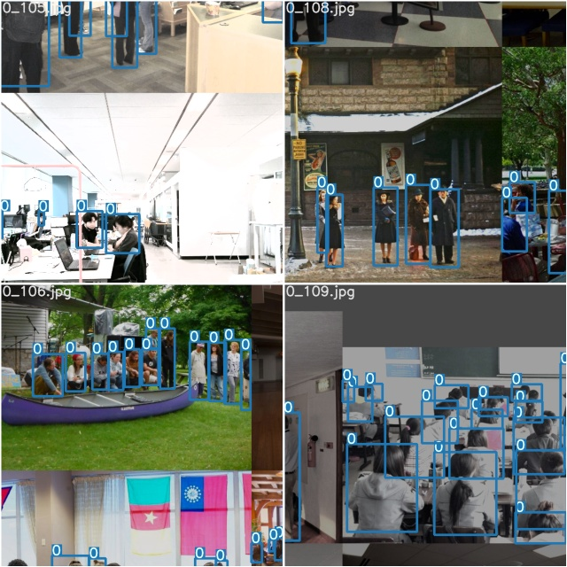
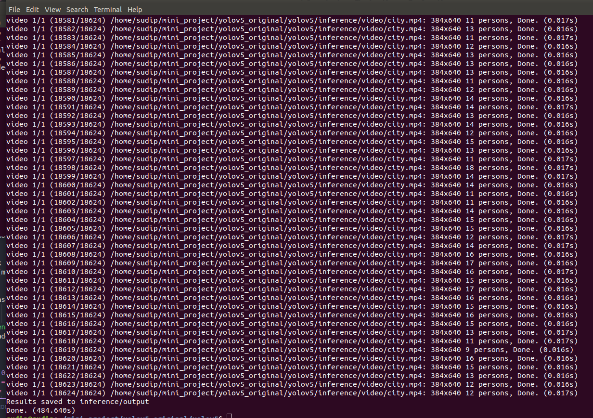

People Tracking 
============

Object tracking is a field within computer vision that involves tracking and detecting objects as they move across several video frames. Both detection and tracking people are challenging problems. Especially in complex real world scenes that commonly involve multiple people, complicated occlusions and cluttered or even moving backgrounds. 


<table border="0">
   <tr>
      <td>
      
      </td>
     </tr>
   </table>


In this project, I tried to use `YOLO-V5 PyTorch` framework to track pedestrains. 

Table of contents
==================

<!--ts-->
* [Data-Collection](#Data-Collection)
     *[Annotation](#Annotation)
* [Framework](#Framework)
* [Training](#Traing)
* [Result](#Result)
      
<!--te-->

Data-Collection
================
Data collection, Data pre-processing task are eccential in every Deep learning project. In this project, I collected around 1000 images from different areas such as street, park, library, class room. 

Annotation
===========

Another main task is labeling every object of the images. Since I requaried one class (i.e. `person` ), I use (`lablemg`)[https://github.com/tzutalin/labelImg] api to annotate my images. Sample of annotation files and image is given below:

**Sample of `.xml` file**

```
<annotation>
	<folder>img</folder>
	<filename>1.jpg</filename>
	<path>/home/sudip/Desktop/anotation/img/1.jpg</path>
	<source>
		<database>Unknown</database>
	</source>
	<size>
		<width>3264</width>
		<height>2448</height>
		<depth>3</depth>
	</size>
	<segmented>0</segmented>
	<object>
		<name>person</name>
		<pose>Unspecified</pose>
		<truncated>0</truncated>
		<difficult>0</difficult>
		<bndbox>
			<xmin>220</xmin>
			<ymin>1135</ymin>
			<xmax>408</xmax>
			<ymax>1441</ymax>
		</bndbox>
	</object>
</annotation>
```

**Sample of annotation image**

<table border="0">
   <tr>
      <td>
      
      </td>
   </tr>
</table>


Framework
===========


Training
=============

<table border="0">
   <tr>
      <td>
      
      </td>
      <td>
      
      </td>
   </tr>
</table>


<table border="0">
   <tr>
      <td>
      
      </td>
      <td>
      
      </td>
   </tr>
   </table>


<table border="0">
   <tr>
      <td>
      
      </td>
   </tr>
   </table>

Result
=======
<table border="0">
   <tr>
      <td>
      
      </td>
      <td>
      
      </td>
   </tr>
</table>


<table border="0">
   <tr>
      <td>
      
      </td>
      <td>
      
      </td>
      <td>
      
      </td>
      <td>
      
      </td>
   </tr>
   </table>


Test
=====

<table border="0">
   <tr>
      <td>
      
      </td>
      <td>
      
      </td>
     </tr>
   </table>


[Demo video](https://www.youtube.com/watch?v=a7xQ0Zo8IEA)


**Images**


 
 
 
